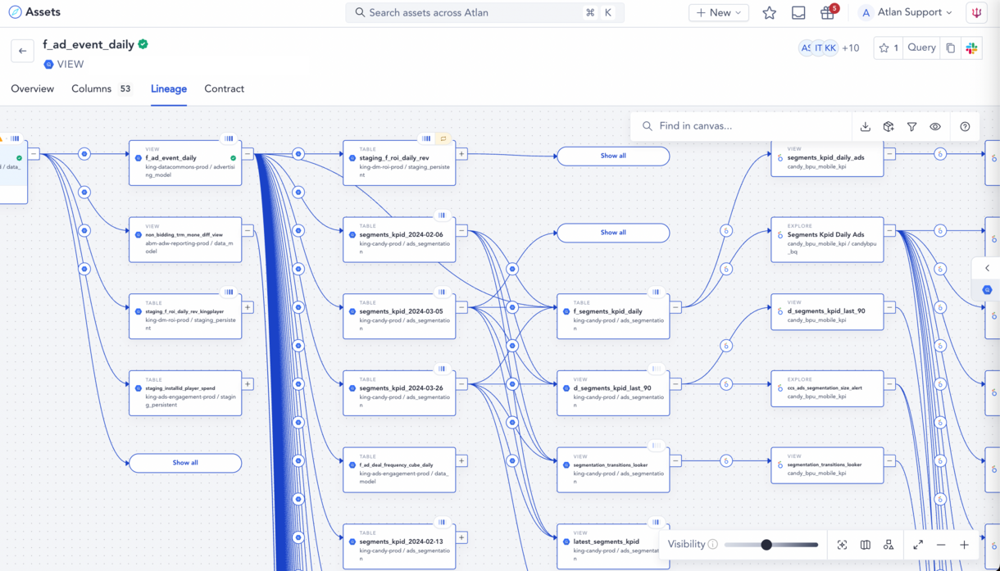
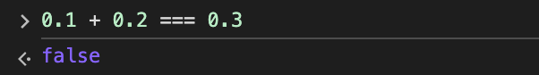

# Preface

I've got you with this catchy title, but gimme a minute; really quickly, I want to give
you some background on the way we at Atlan fixed our testing troubles.

A feature that we were working on happened to be un-testable with
unit tests and E2E test suites; we were developing a Directed Graph (Digraph)
renderer on the front-end that paints nodes and edges into an HTML `<canvas>` element. It looked
something like this:

<br />


<p style="width: 100%; text-align: center;">
Data Lineage - The digraph renderer
</p>

<br />

Since we were rendering into the canvas, it was difficult to test
our feature due to `<canvas>`'s lack of DOM representation.
Screenshot comparison or pixel-based verification is difficult,
and so is simulating click events because that needs coordinate-based positioning.

**...so, we made it so the code tests itself.**

We threw the tests INTO the code that we wrote, as opposed to running CI workflows for
unit tests or E2E tests. This also means that the tests run during the app's run-time.

The outcomes were:
- We were able to test if what we rendered onto the canvas was actually correct. 
- Make sure that the data we are fetching from the back-end is of the correct form.
- The state of the front-end app is correct and is never something we don't expect.
- The assumptions that we make about our code and it's state are correct.

We essentially defined a set of "allowed behaviours" that the app should operate in.
And any time the app does something that we don't expect, we know exactly what to fix.
We defined the "happy path" and made sure we know when the app diverges from it.

<hr />

### ...But how did we do that?

# Enter: Assertions

When we write code, we tend to make reasonable assumptions about the code and
the environment we are writing the code in.

These assumptions could be about the state of your system, the data within the system and how it is passed around,
what functions expect as input and are expected to output, their interfacing, and so on.

Sometimes, these assumptions are wrong and this results in developer errors.

Like this well-known behaviour in JavaScript:

<br />



<br />

To no fault of the developer, they would incorrectly assume `0.1 + 0.2` to be `0.3`.
Because why would anyone ever assume otherwise?

Assertions are a way to enforce correctness into your code such that your code itself screams
at you when it is doing something you didn't expect it to, or when it is working with something you didn't
expect it to.

This also results in a subtle difference in the way you think of testing:
- With unit tests, you account for edge cases and make sure they are handled properly.
- With assertions, you define the happy path of the software directly, and anytime the code diverges from it, it will automatically complain.

We'll move on to much more powerful examples of assertions, but let's start with
some really simple assertions just using `console.assert`, before we get to the heart of it:

```ts
type Foo = {
  bar?: any // Peak production TypeScript code
}

const factorialFoo = (foo: Foo) => {
  console.assert(Number.isInteger(foo.bar), "bar must exist and must be an integer")
  console.assert(foo.bar > 0, "bar must be positive")

  // We now proceed with the confidence that our assumptions are true
  return factorial(foo.bar)
}

// Every time you use the function in an unintended way, the assertion fails.
factorialFoo({ bar: '5.2' })    // Assertion failed: bar must exist and must be an integer
factorialFoo({})                // Assertion failed: bar must exist and must be an integer
factorialFoo({ bar: -5 })       // Assertion failed: bar must be positive

// But with valid input, it works just as expected:
factorialFoo({ bar: 5 })        // 120
```

So what just happened here?

We wrote two assertions within our function definition that state exactly
what conditions must be true for our function to work as expected:

`"bar must exist and must be an integer"` and `"bar must be positive or 0"`.

Any time these assumptions are false, `console.assert` will tell you that the assertion is failing.

We have essentially programmed in an invariance; that `Foo.bar` should always be a number.

### **Instead of making safeguards for all that `foo.bar` could be, we asserted exactly what it _should be_**.

But this isn't yet using assertions to their full capacity.

# Levelling up our asserts

So far in this blog I've shown you just a basic use case of assertions with `console.assert`, but here's
the gist of a custom `assert()` function that you would actually use:

This (still basic) `assert` implementation has the following features:
- A way to run the assertion you wrote only in development mode, and some in dev and production builds as well.
- A way to track when the assertion fails and log it for Sentry-like error monitoring
- Should be a zero-cost implementation when needed, since assertions run during the run-time..

```ts
const env = import.meta.env.MODE
const isDev = env === 'development'

const noOp = () => {}

const createAssertFn = (shouldRun) => (shouldRun ? console.assert : noOp)

const createTrackErrorFn = (shouldRun) =>
    shouldRun
        ? (condition, ...args) => {
              if (!condition) {
                  trackEvent('assertion_failed', {
                      programState: args,
                  })
              }
          }
        : noOp

export const assert = () => {
    return {
        assertFnDev: createAssertFn(isDev),
        assertFn: createAssertFn(!isDev),
        assertTrackErrorDev: createTrackErrorFn(isDev),
        assertTrackError: createTrackErrorFn(!isDev),
    }
}
```
